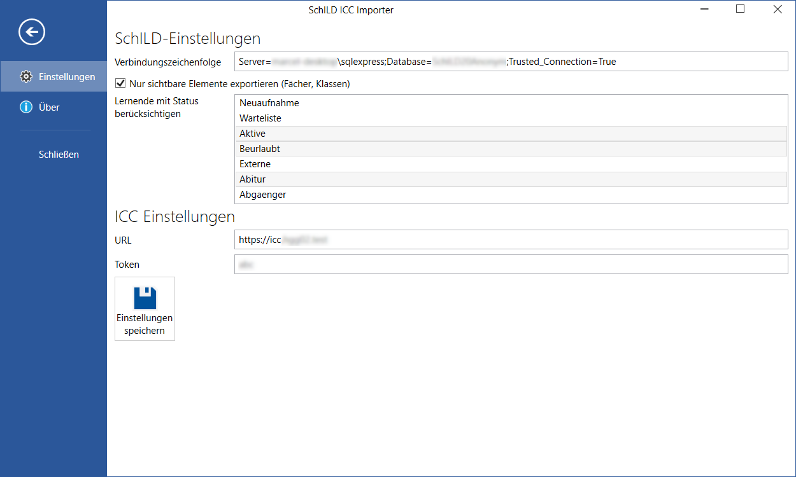

# SchILD ICC Importer

[](https://dev.azure.com/schulit/SchILD%20ICC%20Importer/_build/latest?definitionId=11&branchName=master)


Dieses Tool importiert die Daten aus SchILD ins das ICC. Dazu nutzt sie die [SchildExport-Bibliothek](https://github.com/schulit/schildexport).

## Installation

Installationspakete gibt es [auf GitHub](https://github.com/SchulIT/schild-icc-importer/releases).

## Konfiguration

Die Konfiguration kann über die grafische Oberfläche vorgenommen werden.



**Hinweis:** Die Konfiguration des Tag-Mappings kann aktuell nicht über die GUI vorgenommen werden.

Die Konfigurationsdatei befindet sich im Verzeichnis `C:\ProgramData\SchulIT\SchildIccImporter` als `settings.json`.

```json
{
  "schild": {
    "only_visible": true,
    "student_status": [
      2,
      3,
      8
    ],
    "leave_date": null,
    "connection_string": ""
  },
  "icc": {
    "url": "",
    "token": ""
  },
  "teacher_tag_mappings": {
    "W": "referendare"
  }
}
```

Erklärung:

* `schild.only_visible` legt fest, ob nur in SchILD sichtbare Einträge exportiert werden sollen (empfohlen)
* `schild.student_status` legt fest, welche Schülerinnen und Schüler als aktiv angesehen werden
* `schild.leave_date` legt das Verlassdatum fest, bis zu welchem ein Schüler oder eine Schülerin als aktiv angesehen wird. Ist das Feld `null` wird immer der aktuelle Tag gewählt
* `schild.connection_string` legt die Verbindungszeichenfolge zum MySQL oder SQL-Server fest (siehe [SchildExport Bibliothek](https://github.com/schulit/schildexport))
* `icc.url` legt die Basis URL des ICC fest (ohne Slash am Ende)
* `icc.token` legt das API Token fest
* `teacher_tag_mappings` enthält Mappings zum Hochladen von Lehrertags. Es handelts ich dabei um ein Dictionary. Der Schlüssel repräsentiert das Rechtsverhältnis der Lehrkraft und der Wert den Schlüssel des zugehörigen Lehrertags im ICC

## Konsolenprogramm

Das Konsolenprogramm kann genutzt werden, um die Informationen in regelmäßigen Abständen (bspw. mittels Aufgabe) in das ICC zu importieren. Die Konfiguration im oben genannten Verzeichnis wird dazu genutzt.

Das Programm befindet sich im Programmverzeichnis unter `Console` (es gibt keinen Startmenüeintrag).

```
SchildIccImporter.Cli 1.0.0
Copyright (C) 2020 SchulIT

  --teachers         Lehrkräfte ins ICC importieren.

  --students         Lernende ins ICC importieren.

  --grades           Klassen/Jgst. ins ICC importieren.

  --subjects         Fächer ins ICC importieren.

  --studygroups      Lerngruppen ins ICC importieren.

  --memberships      Lerngruppen-Mitgliedschaften ins ICC importieren.

  --tuitions         Unterrichte ins ICC importieren.

  --teachergrades    Klassenleitungen ins ICC importieren.

  --privacy          Privatsphären-Kategorien ins ICC importieren.

  --help             Display this help screen.

  --version          Display version information.
```

Die Reihenfolge der Parameter spielt keine Rolle. Das Programm wählt immer die korrekte Reihenfolge.

⚠ Beim Import muss man Abhängigkeiten beachten! Beispiel: Bevor man Schülerinnen und Schüler importieren kann, müssen die Klassen/Jgst. importiert worden sein.
